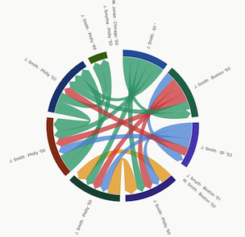
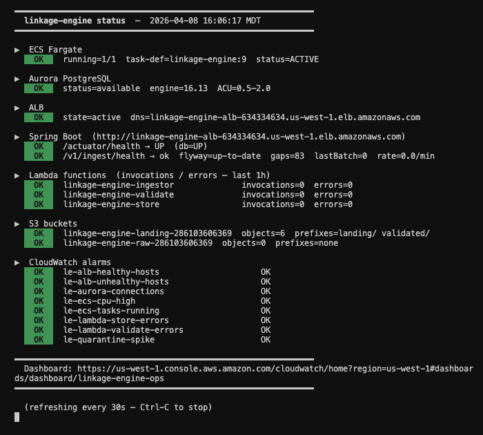
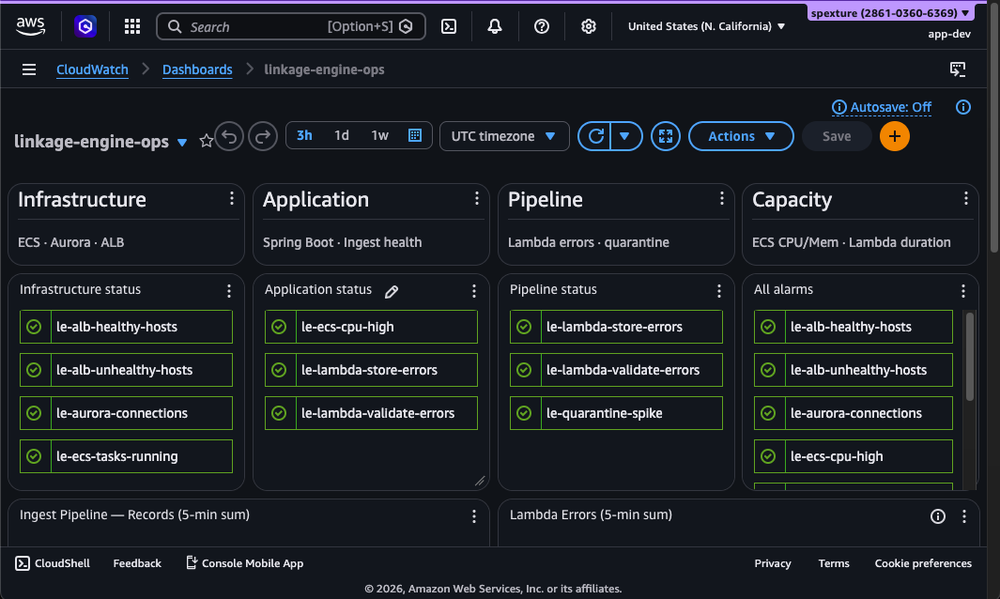

# linkage-engine

**linkage-engine** is a genealogical record linkage service that answers the question: _could these two historical records describe the same person?_

It resolves ambiguous names, locations, and dates using a four-stage pipeline — deterministic SQL search, vector similarity reranking, LLM semantic summary, and spatio-temporal plausibility.

It is backed by Spring AI, pgvector on Aurora PostgreSQL Serverless v2, Bedrock Titan embeddings, and deployed on ECS Fargate.

### Genealogical records - similarity graph



This [chord diagram](https://observablehq.com/@d3/chord-diagram/2) visualizes 12 seeded genealogical records — variants of John Smith, Jon Smyth, Johnny Smith, John Smythe, and Mary Smith spanning Boston, Philadelphia, New York, and San Francisco between 1849 and 1852.

Each arc segment is a record — a person, place, and year (e.g. *J. Smith, Boston 1850*). A chord between two records represents a possible travel event: could the same person have moved from one location to the other in the time available? **Chord colour** shows how plausible that journey was given 19th-century travel speeds:

| Colour | Meaning                                                           |
| :----- | :---------------------------------------------------------------- |
| Green  | Very comfortable — available time is 10× or more than travel time |
| Blue   | Comfortable — 4–10× travel time available                         |
| Purple | Moderate — 2–4× travel time available                             |
| Amber  | Tight — less than 2× travel time, but still plausible             |
| Red    | Physically impossible — travel time exceeds the available window  |

Served at `/chord-diagram.html` — locally on port 8080, or via the [ALB](docs/DEPLOYMENT_ECS_FARGATE.md) when deployed to AWS.

---

### Linkage-Engine Dashboard (terminal view)


Snapshot of terminal status dashboard of all AWS Services running on Gateway/ECS.

### Linkage-Engine Dashboard (AWS CloudWatch view)


Snapshot of AWS Cloudwatch dashboard showing live status of all linkage-engine AWS Services running on Gateway/ECS.

---

## What Was Built

**Four-stage hybrid resolution pipeline:**

```
POST /v1/linkage/resolve
  └─ Stage 1: Deterministic SQL search    (always on)
  └─ Stage 2: pgvector cosine rerank      (gates on Bedrock Titan embeddings)
  └─ Stage 3: Bedrock Converse summary    (gates on LINKAGE_SEMANTIC_LLM_ENABLED=true)
  └─ Stage 4: Spatio-temporal validation  (always on; historical transit plausibility)
```

| Sprint | Deliverable                                                                                              |
| :----- | :------------------------------------------------------------------------------------------------------- |
| 1      | Build, boot, pgvector Docker — app starts in ~2.5s from a clean clone                                    |
| 2      | Ingestion pipeline — `CleansingProvider` chain (`OCRNoiseReducer`, `LocationStandardizer`), chunk, embed |
| 3      | Hybrid search — SQL narrowing → pgvector cosine rerank → Bedrock Converse summary                        |
| 4      | Spatio-temporal validation — historical transit speed table, `ConflictRule` chain, confidence penalty    |
| 5      | Remaining endpoints, 80%+ branch coverage, demo scripts, Aurora Serverless v2 provisioning guide         |

**Demo story in two calls:**

- Philadelphia → New York 1850→1851: `plausible=true`, `railroad_eastern`, high confidence
- Boston → San Francisco same month: `plausible=false`, `ocean_ship`, confidence penalised by 50 pts

**Three design patterns carried through every sprint:**

- `ObjectProvider` over `@ConditionalOnBean` — bean ordering in autoconfiguration is non-deterministic; runtime null-checks are not
- Chain of Responsibility for both cleansing (`CleansingProvider`) and conflict rules (`ConflictRule`) — adding a new step is a one-file change
- Profile-gated graceful degradation — each stage has a defined fallback; the pipeline never hard-fails on a missing dependency

---

## Local Quick Start (under 5 minutes)

### 1. Start PostgreSQL + pgvector

```bash
docker run -d \
  --name pgvector-db \
  -e POSTGRES_USER=ancestry \
  -e POSTGRES_PASSWORD=password \
  -e POSTGRES_DB=linkage_db \
  -p 5434:5432 \
  ankane/pgvector
```

Verify:

```bash
docker exec pgvector-db psql -U ancestry -d linkage_db \
  -c "SELECT extname, extversion FROM pg_extension WHERE extname = 'vector';"
# Expected: vector | 0.5.1
```

### 2. Configure environment

```bash
cp .env.example .env
# Edit .env if your Docker port differs from 5434
```

Minimum required for local dev (already set in `.env.example`):

```env
DB_URL=jdbc:postgresql://localhost:5434/linkage_db
DB_USER=ancestry
DB_PASSWORD=password
LINKAGE_SEMANTIC_LLM_ENABLED=false
```

### 3. Run

```bash
set -a && source .env && set +a
./mvnw spring-boot:run -Dspring-boot.run.profiles=local
```

Expected startup log:

```
Started LinkageEngineApplication in ~2.5 seconds
```

### 4. First resolve call

```bash
curl -s -X POST http://localhost:8080/v1/linkage/resolve \
  -H "Content-Type: application/json" \
  -d '{"givenName":"John","familyName":"Smith","approxYear":1850,"location":"Boston"}' \
  | python3 -m json.tool
```

You should see a `LinkageResolveResponse` with `spatioTemporalResult`, `rulesTriggered`, and `semanticSummary`.

---

## All Endpoints

### `POST /v1/records` — Ingest a record

```bash
curl -s -X POST http://localhost:8080/v1/records \
  -H "Content-Type: application/json" \
  -d '{
    "recordId": "R-001",
    "givenName": "John",
    "familyName": "Smith",
    "eventYear": 1850,
    "location": "Philadelphia",
    "rawContent": "John Smith, Philly, 18S0 — census record"
  }'
```

`rawContent` is cleansed (OCR noise, city abbreviations) before embedding.
Returns `204 No Content` on success.

---

### `POST /v1/linkage/resolve` — Hybrid entity resolution

```bash
curl -s -X POST http://localhost:8080/v1/linkage/resolve \
  -H "Content-Type: application/json" \
  -d '{
    "givenName": "John",
    "familyName": "Smith",
    "approxYear": 1850,
    "location": "Philadelphia",
    "rawQuery": "john smith philadelphia census 1850"
  }' | python3 -m json.tool
```

Response includes `rankedCandidates` (with inline `vectorSimilarity`), `confidenceScore`, `spatioTemporalResult`, `rulesTriggered`, `semanticSummary`.

---

### `POST /v1/spatial/temporal-overlap` — Standalone spatio-temporal check

```bash
# Plausible: Philadelphia → New York, 1850 → 1851
curl -s -X POST http://localhost:8080/v1/spatial/temporal-overlap \
  -H "Content-Type: application/json" \
  -d '{
    "from": {"recordId":"R-1","location":"Philadelphia","year":1850},
    "to":   {"recordId":"R-2","location":"New York","year":1851}
  }' | python3 -m json.tool

# Implausible: Boston → San Francisco, same month
curl -s -X POST http://localhost:8080/v1/spatial/temporal-overlap \
  -H "Content-Type: application/json" \
  -d '{
    "from": {"recordId":"R-1","location":"Boston","year":1850,"month":1},
    "to":   {"recordId":"R-2","location":"San Francisco","year":1850,"month":2}
  }' | python3 -m json.tool
```

---

### `GET /v1/search/semantic` — Semantic similarity search

```bash
curl -s "http://localhost:8080/v1/search/semantic?q=smith+philadelphia+census&maxResults=5&minScore=0.75"
```

Returns `localProfile: true` with empty results when Bedrock embeddings are not configured.

---

### `GET /v1/context/neighborhood-snapshot` — Neighborhood aggregation

```bash
curl -s "http://localhost:8080/v1/context/neighborhood-snapshot?location=Philadelphia&year=1850" \
  | python3 -m json.tool
```

Returns `recordCount`, `commonNames`, `yearRangeMin/Max`, `contextSummary`.

---

### `PUT /v1/vectors/reindex` — Delta reindex

```bash
# Reindex all records (requires SPRING_AI_MODEL_EMBEDDING=bedrock-titan)
curl -s -X PUT http://localhost:8080/v1/vectors/reindex | python3 -m json.tool

# Delta reindex since a specific date
curl -s -X PUT "http://localhost:8080/v1/vectors/reindex?since=2025-01-01T00:00:00Z"
```

Returns `409 Conflict` when embedding model is not configured.
Uses Java 21 Virtual Threads — each record is embedded in a named virtual thread (`reindex-{recordId}`).

---

### `GET /api/ask` — Chat passthrough

```bash
curl -s "http://localhost:8080/api/ask?q=What+is+genealogical+record+linkage%3F"
```

---

## Bedrock Profile

To enable Bedrock Converse (semantic summary) and Titan embeddings (vector rerank + reindex):

```env
AWS_REGION=us-east-1
BEDROCK_MODEL_ID=us.amazon.nova-lite-v1:0
LINKAGE_SEMANTIC_LLM_ENABLED=true
SPRING_AI_MODEL_EMBEDDING=bedrock-titan
BEDROCK_EMBEDDING_MODEL_ID=amazon.titan-embed-text-v2:0
```

Requires valid AWS credentials with `bedrock:InvokeModel` permissions.

---

## Testing

```bash
./mvnw verify
```

- **149 tests**, 0 failures
- JaCoCo: **94.5% instruction**, **80.3% branch** coverage
- H2 in-memory DB for repository tests; no Docker required for `./mvnw test`

---

## Demo

```bash
# Seed 8 pre-crafted records and run all demo calls
./demo/seed-data.sh
./demo/demo-calls.sh
```

See [demo/README.md](demo/README.md) for the full story.

---

## Infrastructure (Terraform)

All AWS infrastructure is defined as code in `infra/` and managed with Terraform. No manual console changes are needed after the initial bootstrap.

### What Terraform manages

| Module | Resources |
| :----- | :-------- |
| `bootstrap` | S3 remote state bucket + DynamoDB lock table |
| `ecr` | ECR repository with lifecycle policy (keep 10 tagged, expire untagged after 14 days) |
| `networking` | Security groups for ALB, ECS, and Aurora; ingress/egress rules |
| `aurora` | Aurora PostgreSQL Serverless v2 cluster + writer instance (scales 0–2 ACUs) |
| `secrets` | Secrets Manager secret holding `DB_URL`, `DB_USER`, `DB_PASSWORD`, `INGEST_API_KEY` |
| `iam` | ECS execution role, ECS task role (Bedrock), GitHub OIDC deploy role |
| `alb` | Application Load Balancer, target group, HTTP/HTTPS listeners |
| `acm` | ACM certificate (created only when `domain_name` is set) |
| `waf` | WAFv2 WebACL with 500 req/5 min rate limit, associated to ALB |
| `ecs` | ECS cluster (Container Insights on), task definition, Fargate service |
| `monitoring` | CloudWatch log group, SNS alert topic, 5 CloudWatch alarms, AWS Budget |

### Directory layout

```
infra/
├── bootstrap/          # One-time setup: S3 state bucket + DynamoDB lock
│   ├── main.tf
│   └── tests/
├── modules/            # Reusable modules (each has main.tf, variables.tf, outputs.tf, tests/)
│   ├── ecr/
│   ├── networking/
│   ├── aurora/
│   ├── secrets/
│   ├── iam/
│   ├── alb/
│   ├── acm/
│   ├── waf/
│   ├── ecs/
│   └── monitoring/
├── envs/
│   └── prod/           # Production root module — wires all modules together
│       ├── main.tf
│       ├── variables.tf
│       ├── outputs.tf
│       ├── versions.tf
│       └── terraform.tfvars.example
└── import.sh           # Imports pre-existing AWS resources into state
```

### First-time setup

```bash
# 1. Bootstrap remote state (one time only)
cd infra/bootstrap
terraform init && terraform apply

# 2. Configure prod variables
cd ../envs/prod
cp terraform.tfvars.example terraform.tfvars
# Edit terraform.tfvars — set aws_account_id, github_repo, etc.

# 3. Import any pre-existing AWS resources
bash ../../import.sh

# 4. Apply
terraform plan   # review
terraform apply
```

See [`infra/README.md`](infra/README.md) for the full guide including HTTPS, DNS, and budget configuration.

### Deploying a new application version

Infrastructure changes are applied manually with `terraform apply`. Application deploys (new Docker image → ECS) go through GitHub Actions and do **not** require Terraform:

```bash
# From the project root — triggers build → ECR push → ECS rolling deploy
gh workflow run deploy-ecr-ecs.yml --ref main
```

The CI workflow registers a new ECS task definition revision with the new image SHA and calls `update-service`, requiring only narrow ECR + ECS permissions. Full Terraform access is never needed in CI.

### Module tests

Every module ships with mock-provider unit tests (`terraform test`) — no AWS credentials required:

```bash
# Run all module tests from the repo root
for mod in infra/modules/*/; do
  echo "=== $mod ===" && (cd "$mod" && terraform init -quiet && terraform test)
done
# 88 tests, 0 failures
```

### Monitoring & alerts

Five CloudWatch alarms send to an SNS topic (`linkage-engine-alerts`). Set `alert_email` in `terraform.tfvars` to receive email notifications:

| Alarm | Fires when |
| :---- | :--------- |
| `le-aurora-connections` | Aurora has 0 active connections (paused or app down) |
| `linkage-engine-ecs-memory-high` | ECS task memory > 80% |
| `linkage-engine-aurora-storage-low` | Aurora free storage < 20 GiB |
| `linkage-engine-alb-healthy-hosts` | ALB healthy target count < 1 |
| `linkage-engine-ecs-tasks-running` | Running ECS task count < 1 |

An AWS Budget fires at 80% of a configurable monthly spend limit (default $50/month).

---

## Documentation

| Document                                                              | Contents                                                                                                      |
| :-------------------------------------------------------------------- | :------------------------------------------------------------------------------------------------------------ |
| [infra/README.md](infra/README.md)                                    | Terraform quick start, module reference, import guide, CI/CD integration                                      |
| [ARCHITECTURE.md](docs/ARCHITECTURE.md)                               | Four-stage pipeline, design patterns, Mermaid diagrams, DB index strategy                                     |
| [DEPLOYMENT_ECS_FARGATE.md](docs/DEPLOYMENT_ECS_FARGATE.md)           | ECS / Fargate deployment, ALB, health checks, demo lifecycle                                                  |
| [SECRETS_MANAGER.md](docs/SECRETS_MANAGER.md)                         | AWS Secrets Manager for runtime DB credentials in ECS                                                         |
| [DATA_PIPELINE_S3.md](docs/DATA_PIPELINE_S3.md)                       | S3 bucket layout, ingest pipeline, archival policy, Athena DDL                                                |
| [AURORA_POSTGRESQL.md](docs/AURORA_POSTGRESQL.md)                     | Aurora provisioning, PITR disaster recovery, version notes                                                    |
| [OPERATIONAL_RESILIENCE_PLAN.md](docs/OPERATIONAL_RESILIENCE_PLAN.md) | All sprints — generator integrity, Lambda idempotency, validation pipeline, security hardening, observability |
| [ELEVATOR.md](docs/ELEVATOR.md)                                       | One-page project summary                                                                                      |
