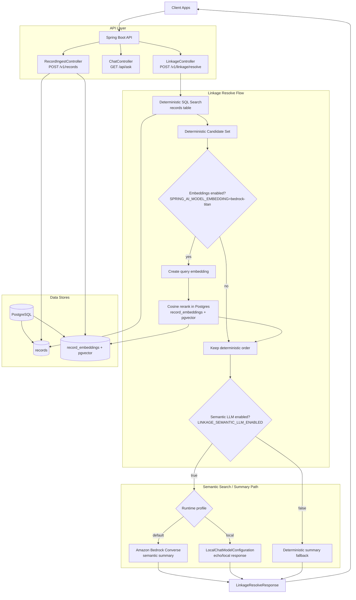
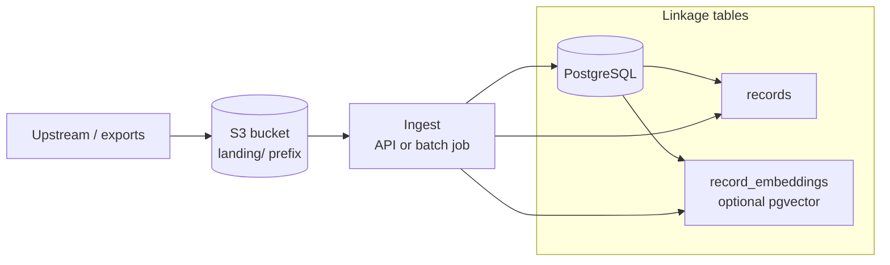

# Architecture Overview: linkage-engine

## 1. Technical Stack
| Layer | Technology |
| :--- | :--- |
| **Language** | Java 21 (Virtual Threads / Project Loom) |
| **Framework** | Spring Boot 3.2.4 |
| **AI Orchestration** | Spring AI 1.0.0 |
| **LLM Provider** | Amazon Bedrock Converse (chat) + InvokeModel Titan (embeddings, optional) |
| **Vectors** | Native `pgvector` columns on `record_embeddings` (Flyway); Spring `PgVectorStore` autoconfig is disabled |
| **Raw landing storage (standard)** | Amazon S3 (`landing/` prefix by convention); searchable linkage data lives in PostgreSQL after ingest — see `docs/DATA_PIPELINE_S3.md` |
| **Build Tool** | Maven |

---

## 1.1 System Diagram



**Notes:**
- Deterministic SQL search runs against PostgreSQL wherever `DB_URL` points (local Docker, on-prem, or AWS RDS/Aurora).
- Bedrock is only used for LLM/embedding calls in the semantic stage; SQL itself is not moved to Bedrock.
- The local profile intentionally bypasses Bedrock for fast local development.

---

## 1.2 Standard raw-data pipeline (S3 → PostgreSQL)

**Standard:** raw exports and bulk source files are stored in **S3** (shared “landing zone”). **Search and linkage** use **PostgreSQL** after ingest — S3 is not queried like a database. Ingest may be `POST /v1/records`, a batch job (ECS/Lambda/script), or ETL that loads `records` / `record_embeddings`.

Full conventions (prefixes, IAM, local vs AWS access, env vars): **`docs/DATA_PIPELINE_S3.md`**.



---

## 2. Core High-Value Endpoints

### 1. Entity Resolution (implemented)
* **`POST /v1/linkage/resolve`**
    * **Purpose:** Resolves "John Smith" style ambiguities.
    * **Logic:** (1) Deterministic SQL on `records` (name/year/location). (2) If `SPRING_AI_MODEL_EMBEDDING=bedrock-titan` and rows exist in `record_embeddings`, embed the query (Titan) and rerank candidates by cosine similarity in Postgres. (3) Bedrock Converse summarizes ranked candidates.
* **`POST /v1/records`** — upsert a person row; optional embedding write to `record_embeddings` when Titan is enabled. Bulk raw files are expected to land in **S3** first per `docs/DATA_PIPELINE_S3.md`, then feed this path or a batch ingest job.

### 2. Spatio-Temporal Validation (The "Truth Engine")
* **`POST /v1/spatial/temporal-overlap`**
    * **Purpose:** Validates historical plausibility.
    * **Logic:** Calculates if a person’s movement between two points (e.g., 1850 Boston to 1852 San Francisco) is physically possible given historical transit constraints. It identifies migration clusters by grouping records by geographic radius and time-windows.

### 3. Semantic Context & RAG
* **`GET /v1/search/semantic`**
    * **Purpose:** Natural language interface for structured metadata.
* **`GET /v1/context/neighborhood-snapshot`**
    * **Purpose:** Aggregates local "vibe" data (census, news, weather) into a searchable context to provide grounding for LLM-generated ancestor narratives.

### 4. System Management
* **`PUT /v1/vectors/reindex`**
    * **Purpose:** Handles delta-updates to the embedding store to ensure new digitized records are searchable without a full system re-index.

---

## 3. Design Principles
* **Semantic Interoperability:** Bridging structured database records with unstructured natural language using `Spring AI`.
* **Model Agnostic:** The architecture uses Spring AI abstractions so we can swap OpenAI for local models (like Llama 3) without code changes.
* **High Concurrency:** Java 21 Virtual Threads ensure the service doesn't block while waiting for LLM or Vector DB responses.
* **Data Integrity:** Strict null-analysis and Lombok-backed DTOs to handle the "messy" nature of genealogical data.

---

## 4. System Components
* **`LinkageController`:** Handles REST traffic and input validation.
* **`VectorOrchestrator`:** Manages the flow of data between the app and the PGVector store.
* **`ConflictResolver`:** A rules-based engine for checking biological and physical impossibilities.

---

## 5. Data Flow
1. **Request**: User queries for an ancestor's records.
2. **Augmentation**: The engine retrieves relevant metadata from PostgreSQL.
3. **Vector Search**: The query is embedded and matched against the `pgvector` store.
4. **Synthesis**: The OpenAI Chat Model analyzes candidates and returns the most likely "link" with a confidence score.
5. **Validation**: The Linkage Resolver runs a final check against spatial-temporal constraints.

---
## Questions

* **Why PGVector?** It keeps our "Source of Truth" (relational data) and our "Semantic Context" (vectors) in a single ACID-compliant database.
* **Why Spring AI?** It provides a clean abstraction. If we need to move to an in-house model, we swap the starter without rewriting the core linkage logic.
* **Java 21 Virtual Threads:** This is the ideal use case—waiting on high-latency I/O (LLM APIs) without wasting memory on blocked platform threads.

---
### What is RAG?

Retrieval-Augmented Generation (RAG) is an architectural pattern used to optimize the output of a Large Language Model (LLM) by referencing a specific, authoritative knowledge base outside of its initial training data.

In the context of the linkage-engine and Ancestry, RAG is the "bridge" that allows a general model (like GPT-4) to answer questions using private or specialized data (like 19th-century census records or specific family trees).

How RAG Works (The 3-Step Process):
#### 1. Retrieval: When a user asks a question, the system searches a Vector Database (like your pgvector setup) to find the most relevant "chunks" of information based on semantic similarity.

#### 2. Augmentation: The system takes those specific data chunks and adds them to the user's original prompt as "context."

#### 3. Generation: The LLM reads both the question and the provided context to generate an answer that is grounded in facts, significantly reducing "hallucinations."

### RAG Performance issues
In order to optimize performance, memory usage, and compute time, the retrieval stage takes steps to define the minimum set of chunks of data that need to be read from external storage, like S3.

### Why it matters
Ancestry likely uses RAG to turn cold, structured records into narrative stories. Instead of an LLM guessing what happened in 1850, the RAG flow provides the model with the exact census and property records found by your linkage-engine, allowing it to write a factually accurate biography.

---
## RAG Implementation
To implement a RAG service in Spring Boot, LangChain4j is the most streamlined choice. It integrates perfectly with Java 21/Spring Boot 3.4 stack and the pgvector database.

The production-ready service implementation.

### Maven dependencies
<dependencies>
    <dependency>
        <groupId>dev.langchain4j</groupId>
        <artifactId>langchain4j-spring-boot-starter</artifactId>
        <version>0.31.0</version>
    </dependency>

    <dependency>
        <groupId>dev.langchain4j</groupId>
        <artifactId>langchain4j-open-ai-spring-boot-starter</artifactId>
        <version>0.31.0</version>
    </dependency>

    <dependency>
        <groupId>dev.langchain4j</groupId>
        <artifactId>langchain4j-pgvector</artifactId>
        <version>0.31.0</version>
    </dependency>
</dependencies>
```

### AI Service Interface
The `GET /v1/search/semantic` endpoint is the "Retrieval" part of the RAG cycle. It fetches the "Neighborhood Snapshot" or "Entity Matches" which are then fed into the LLM to provide the Confidence Score mentioned in the Vision statement.

In LangChain4j, you define an interface. The library handles the complex "retrieval-then-prompt" logic behind the scenes.

```java
package com.spexture.linkage.service;

import dev.langchain4j.service.SystemMessage;
import dev.langchain4j.service.UserMessage;
import dev.langchain4j.service.spring.AiService;

@AiService
public interface LinkageAssistant {

    @SystemMessage("""
        You are a Genealogical Research Assistant. 
        Use the provided historical records to determine if two entities match.
        Always provide a 'Confidence Score' from 0-100% and justify your reasoning. If the movement between locations is physically impossible for the time period, lower the confidence score significantly.
        """)
    String analyzeMatch(@UserMessage String userQuery);
}
```

### RAG Configuration
This configuration tells Spring Boot how to connect your Vector Store (pgvector) to the LLM (OpenAI).

```java
package com.spexture.linkage.config;

import dev.langchain4j.data.segment.TextSegment;
import dev.langchain4j.model.embedding.EmbeddingModel;
import dev.langchain4j.model.openai.OpenAiEmbeddingModel;
import dev.langchain4j.rag.content.retriever.ContentRetriever;
import dev.langchain4j.rag.content.retriever.EmbeddingStoreContentRetriever;
import dev.langchain4j.store.embedding.EmbeddingStore;
import dev.langchain4j.store.embedding.pgvector.PgVectorEmbeddingStore;
import org.springframework.context.annotation.Bean;
import org.springframework.context.annotation.Configuration;

@Configuration
public class RagConfig {

    @Bean
    public EmbeddingStore<TextSegment> embeddingStore() {
        return PgVectorEmbeddingStore.builder()
                .host("localhost")
                .port(5432)
                .database("linkage_db")
                .user("ancestry")
                .password("password")
                .table("test_embeddings")
                .dimension(1536) // Dimension for OpenAI text-embedding-3-small
                .build();
    }

    @Bean
    public ContentRetriever contentRetriever(
            EmbeddingStore<TextSegment> store, 
            EmbeddingModel model) {
        return EmbeddingStoreContentRetriever.builder()
                .embeddingStore(store)
                .embeddingModel(model)
                .maxResults(5) // Retrieve top 5 most similar historical records
                .minScore(0.75) // Only include records with high similarity
                .build();
    }
}
```

#### Controller Implementation
```java
package com.spexture.linkage.controller;

import com.spexture.linkage.service.LinkageAssistant;
import org.springframework.web.bind.annotation.*;

@RestController
@RequestMapping("/v1/linkage")
public class LinkageController {

    private final LinkageAssistant assistant;

    public LinkageController(LinkageAssistant assistant) {
        this.assistant = assistant;
    }

    @PostMapping("/resolve")
    public String resolveEntity(@RequestBody String entityDescription) {
        // This call triggers the RAG flow:
        // 1. Embeds the input description
        // 2. Searches pgvector for similar records
        // 3. Sends context + question to OpenAI
        // 4. Returns the narrative + confidence score
        return assistant.analyzeMatch(entityDescription);
    }
}
```

### Data Pipeline: The Cleansing Stage
To ensure high-fidelity embeddings, the system implements a **Chain of Responsibility** pattern for data pre-processing:
* **Modular Providers:** Independent services for OCR correction, Spatio-Temporal normalization, and noise reduction.
* **Deterministic Transformation:** Data is scrubbed and standardized before reaching the Vector Store, reducing the "hallucination" rate of the downstream LLM.
* **Metadata Preservation:** Cleansing operations only affect the semantic text, ensuring original record IDs and source links remain intact.

```Java
package com.spexture.linkage.service.cleansing;

public interface CleansingProvider {
    String clean(String input);
}

@Component
class LocationStandardizer implements CleansingProvider {
    @Override
    public String clean(String input) {
        // Example: Regex to find common city abbreviations
        return input.replaceAll("(?i)Philly", "Philadelphia")
                    .replaceAll("(?i)NYC", "New York City");
    }
}

@Component
class OCRNoiseReducer implements CleansingProvider {
    @Override
    public String clean(String input) {
        // Example: Fixing common OCR digit-to-letter swaps in years
        return input.replaceAll("18S0", "1850")
                    .replaceAll("1B60", "1860");
    }
}
```

#### The RecordIngestionService 
This service takes messy genealogical data, cleans it, 
chunks it, and stores it in the pgvector database so that it can be 
retrieved by the RAG flow.

```java
package com.spexture.linkage.service;

import dev.langchain4j.data.document.Document;
import dev.langchain4j.data.document.DocumentSplitter;
import dev.langchain4j.data.document.splitter.DocumentSplitters;
import dev.langchain4j.data.segment.TextSegment;
import dev.langchain4j.model.embedding.EmbeddingModel;
import dev.langchain4j.store.embedding.EmbeddingStore;
import dev.langchain4j.store.embedding.EmbeddingStoreIngestor;
import org.springframework.stereotype.Service;

import java.util.List;

@Service
public class RecordIngestionService {
    // This Service allows record ingestion tasks to run in parallel 
    // to process millions of records.

    private final DataCleansingService cleansingService;
    private final EmbeddingStore<TextSegment> embeddingStore;
    private final EmbeddingModel embeddingModel;

    public RecordIngestionService(
                DataCleansingService cleansingService
                EmbeddingStore<TextSegment> embeddingStore, 
                EmbeddingModel embeddingModel) {
        this.cleansingService = cleansingService;
        this.embeddingStore = embeddingStore;
        this.embeddingModel = embeddingModel;
    }

    /**
     * Ingests a historical record into the vector database.
     * Use this for names, family clusters, and neighborhood context.
     */
    public void ingestRecord(String rawContent, String recordId) {
        Document rawDoc = Document.from(rawContent);

        // Step 1: Cleanse the data
        Document cleanDoc = cleansingService.transform(rawDoc);

        // Index the data with SQL-queriable metadata:
        // By adding location and recordId to the metadata, we can perform
        // Hybrid Search (deterministic SQL/Location filtering first,
        // then probabilistic semantic/vector search), which is much more
        // efficient than vector search alone.
        cleanDoc.metadata().add("recordId", recordId);
        cleanDoc.metadata().add("location", location);

        // Step 2: Ingest the cleansed data with EmbeddingStoreIngestor,
        // which orchestrates 3 operations:
        //
        // 1. Splitting: It uses a DocumentSplitter to break large documents
        // into smaller, overlapping chunks (segments). By splitting the record
        // (e.g., by 500 tokens with 50-token overlap), we create a "context
        // windows" that prevents data loss at the edges of the text segments.
        //
        // 2. Embedding: It sends those segments to an EmbeddingModel (like 
        // OpenAI's text-embedding-3-small) to convert the text chunks into
        // floating-point vectors.
        //
        // 3. Storing: It saves those vectors and their original text into the
        // EmbeddingStore (i.e. the pgvector database). 
        // 
        EmbeddingStoreIngestor ingestor = EmbeddingStoreIngestor.builder()
                .documentSplitter(DocumentSplitters.recursive(500, 50))
                .embeddingModel(embeddingModel)
                .embeddingStore(embeddingStore)
                .build();

        ingestor.ingest(cleanDoc);
    }
}
```

#### Scaling to ingest billions of records
The EmbeddingStoreIngestor is fine for a low-volume service layer, but for massive scale, it might be best to run this logic within a distributed system like Spark or Flink. Or use AWS Lambda to trigger ingestion as new records land in S3 "Landing Zones".