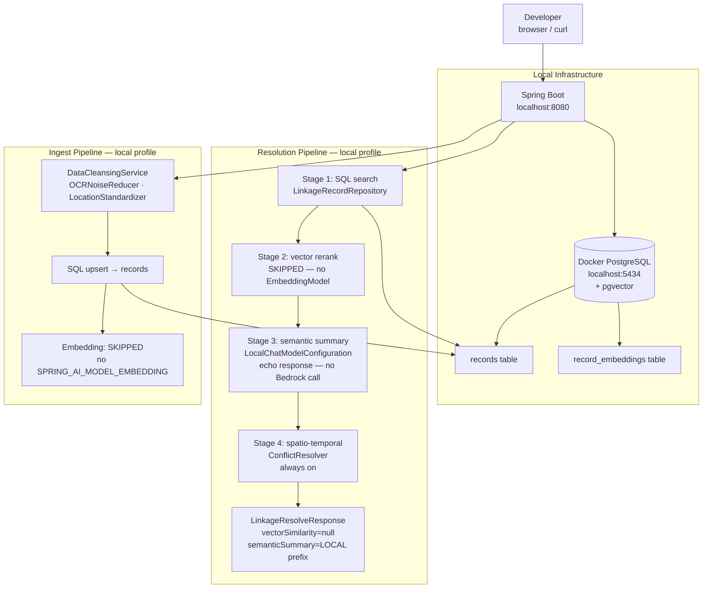
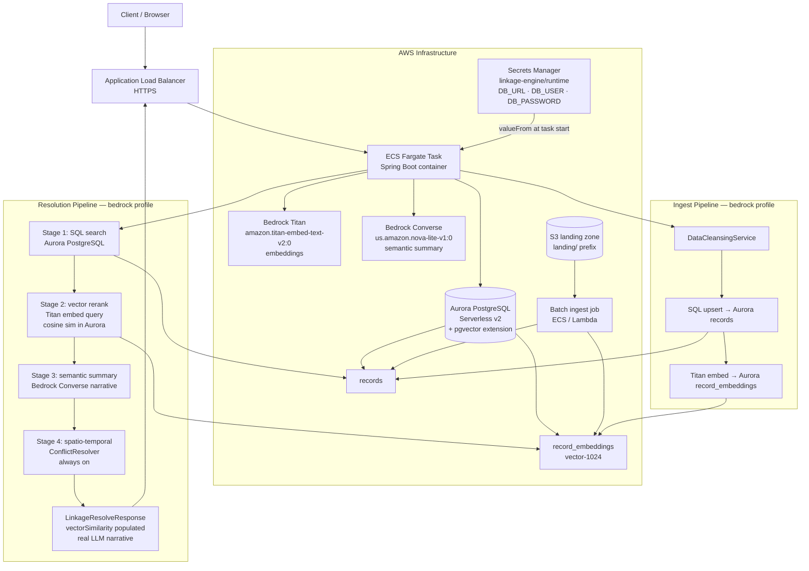
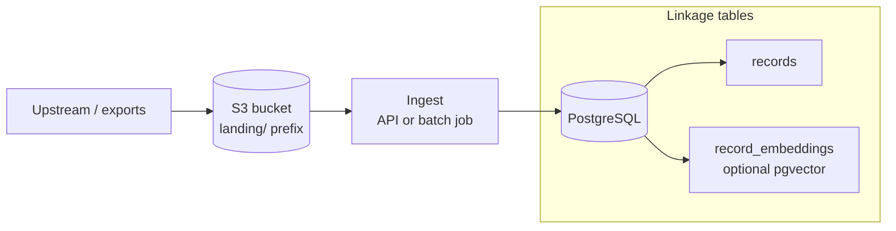

# Architecture: linkage-engine

## 1. Technical Stack

| Layer | Technology |
| :--- | :--- |
| **Language** | Java 21 (Virtual Threads / Project Loom) |
| **Framework** | Spring Boot 3.2 |
| **AI Orchestration** | Spring AI 1.0 |
| **LLM / Embeddings** | Amazon Bedrock Converse (chat) + Titan (embeddings, optional) |
| **Vector store** | Native `pgvector` columns on `record_embeddings` (Flyway-managed); Spring `PgVectorStore` autoconfig is disabled in favour of direct JDBC |
| **Raw landing storage** | Amazon S3 (`landing/` prefix); searchable data lives in PostgreSQL after ingest — see `docs/DATA_PIPELINE_S3.md` |
| **Build** | Maven |

---

## 2. Four-Stage Resolution Pipeline

Every `POST /v1/linkage/resolve` call passes through four ordered stages. Each stage
degrades gracefully when its dependency is absent — the local profile runs all four
stages end-to-end without AWS credentials.

```
POST /v1/linkage/resolve
  └─ Stage 1: SQL search          — deterministic narrowing (name/year/location filters, ±5 year window, LIKE match)
  └─ Stage 2: vector rerank       — cosine similarity reorder (gates on EmbeddingModel bean)
  └─ Stage 3: semantic summary    — LLM narrative (gates on ChatModel + LINKAGE_SEMANTIC_LLM_ENABLED=true)
  └─ Stage 4: spatio-temporal     — historical transit plausibility check (always on; no-op when location/year absent)
```

### Stage 1 — Deterministic SQL search (`LinkageRecordRepository`)
Filters the `records` table on partial name match (`LIKE`), ±5-year window, and
optional location. Returns at most 20 `CandidateRecord` objects ordered by name
relevance. Always runs.

### Stage 2 — Vector rerank (`VectorRerankService`)
Embeds the query via `EmbeddingModel`, fetches stored vectors from `record_embeddings`
for the candidate IDs only (no full-table scan), and reorders by cosine similarity
descending. Skipped silently when `EmbeddingModel` is absent (local profile default).

### Stage 3 — Semantic summary (`SemanticSummaryService`)
Builds a structured prompt from the ranked candidates and calls `ChatModel.call()`.
Returns a `SummaryResult` with a narrative and an `llmUsed` flag.
Falls back to a deterministic summary string when:
- `LINKAGE_SEMANTIC_LLM_ENABLED=false`, or
- `ChatModel` bean is absent, or
- the model call throws.

On the **local profile**, `LocalChatModelConfiguration` provides a `ChatModel` bean
that returns `"[LOCAL] Deterministic summary for: {query}"` — no Bedrock call.

### Stage 4 — Spatio-temporal validation (`ConflictResolver`)
Validates whether movement between the query location/year and the top candidate's
location/year is historically plausible. Uses `HistoricalTransitService` to select
the fastest era-appropriate travel mode and compute minimum travel days via haversine
distance. Runs a `ConflictRule` chain and returns a `SpatioTemporalResponse` with a
full audit trail. Reduces `confidenceScore` by `confidenceAdjustment / 100` when
rules fire. Skipped when either record is missing a location or year.

---

## 3. Local Development Configuration

All four pipeline stages run end-to-end. No AWS credentials required.
Stage 2 (vector rerank) and Stage 3 (Bedrock summary) use local fallbacks.



---

## 4. Production Configuration (ECS / Fargate + Aurora + Bedrock)

All four stages active. DB credentials injected from Secrets Manager at task start.



---

## 5. Ingestion Pipeline (`POST /v1/records`)

```
POST /v1/records (RecordIngestController)
  └─ DataCleansingService          — ordered CleansingProvider chain
       ├─ OCRNoiseReducer          — fixes digit/letter OCR swaps in year-like tokens
       └─ LocationStandardizer     — expands city abbreviations (philly → Philadelphia)
  └─ SQL upsert                    — records table via LinkageRecordMutator
  └─ Embedding (optional)          — TokenTextSplitter → EmbeddingModel → record_embeddings
                                     (gates on SPRING_AI_MODEL_EMBEDDING=bedrock-titan)
```

Raw files from upstream sources are expected to land in **S3** first, then feed
`POST /v1/records` or a batch ingest job. See `docs/DATA_PIPELINE_S3.md`.

---

## 6. Spatio-Temporal Validation (`POST /v1/spatial/temporal-overlap`)

Standalone endpoint backed by the same `ConflictResolver` that Stage 4 uses.
Accepts a `SpatioTemporalRequest` (two anchor records with location + year) and
returns a `SpatioTemporalResponse` with full audit trail.

### Historical transit speed table

| Era | Mode | Speed |
| :--- | :--- | :--- |
| pre-1830 | horse / coach | 50 mi/day |
| 1830–1868 | eastern railroad | 200 mi/day |
| 1869+ | transcontinental rail | 400 mi/day |
| any (cross-continent pre-1869) | ocean ship (Cape Horn) | 150 mi/day, ≥ 18,000 mi |

Distances are straight-line haversine — actual routes are longer, so this is
**generous to plausibility** (under-estimates required travel time).

### ConflictRule chain

| Rule | Trigger | Effect |
| :--- | :--- | :--- |
| `PhysicalImpossibilityRule` | travelDays > availableDays | `plausible=false`, −50 pts |
| `BiologicalPlausibilityRule` | implied age outside [0, 120] (uses `birthYear` field; falls back to `BORN:YYYY:` recordId prefix) | `plausible=false`, −50 pts |
| `NarrowMarginRule` | margin < 5 days (tight but possible) | `plausible=true`, −15 pts |
| `AgeConsistencyRule` | age regresses across records (CONTRADICTS), or age outside lifespan (IMPLAUSIBLE) | `plausible=false`, −40/−50 pts |
| `GenderPlausibilityRule` | inferred genders of the two records conflict (via `GivenNameGenderProvider`, SSA 1880+ data) | `plausible=true`, −20 pts |

`confidenceAdjustment` is capped at 50 regardless of how many rules fire.

### `AgeConsistencyRule` and `AgeEstimator`

`AgeEstimator` computes implied age at each record event year given a `birthYear`
field on `SpatioTemporalRecord`. It returns an `AgeConsistencyResult` with one of
four verdicts: `CONSISTENT`, `CONTRADICTS` (age regressed), `IMPLAUSIBLE` (age
outside [0, 120]), or `UNKNOWN` (no birth year available — conservative skip).

`AgeConsistencyRule` wraps `AgeEstimator` as a `ConflictRule`:
- `CONTRADICTS` → `plausible=false`, −40 pts
- `IMPLAUSIBLE` → `plausible=false`, −50 pts
- `CONSISTENT` / `UNKNOWN` → no penalty

`birthYear` is now a first-class field on `RecordIngestRequest`, `LinkageRecord`,
and `SpatioTemporalRecord`, persisted in the `records.birth_year` column (V5
migration). `BiologicalPlausibilityRule` prefers the field and falls back to the
legacy `BORN:YYYY:` recordId prefix for backwards compatibility.

---

### `GenderPlausibilityRule`

Gender is not currently stored on records, but it can be inferred from given names
using US Social Security Administration name-frequency data. The SSA publishes
yearly name/gender counts from **1880 onward** — exactly the right era for
19th-century genealogical records.

**Implementation plan:**

1. **Data source** — bundle `ssa-names-1880-1910.csv` (name, year, sex, count) as a
   classpath resource. The SSA dataset is public domain and small enough (~500 KB
   for the relevant decades) to ship with the jar.

2. **`GivenNameGenderProvider`** — loads the CSV at startup, computes
   `P(male | name, decade)` for each name. Returns one of `MALE`, `FEMALE`,
   `AMBIGUOUS` (when neither gender exceeds 80% of occurrences), or `UNKNOWN`
   (name not in dataset).

3. **`GenderPlausibilityRule`** — implements `ConflictRule`. Infers gender for
   both records' given names. If both are non-`AMBIGUOUS` and non-`UNKNOWN` and
   they differ, applies a −20 pt `confidenceAdjustment`. Does **not** set
   `plausible=false` — gender inference is probabilistic and historical records
   contain transcription errors and gender-neutral names.

4. **Fits the existing chain** — registered as a Spring `@Component` implementing
   `ConflictRule`. `ConflictResolver` picks it up automatically via the injected
   `List<ConflictRule>`. Zero orchestrator changes required.

**Example outcomes:**

| Record A | Record B | Inferred genders | Effect |
| :--- | :--- | :--- | :--- |
| John Smith, Boston 1850 | Mary Smith, Boston 1850 | M vs F | −20 pts |
| John Smith, Boston 1850 | Jon Smyth, Philadelphia 1851 | M vs M | no penalty |
| Leslie Smith, NYC 1885 | Leslie Jones, Boston 1886 | AMBIGUOUS | no penalty |

---

## 7. Design Patterns

### `ObjectProvider` over `@ConditionalOnBean`
Optional dependencies (`EmbeddingModel`, `RecordEmbeddingStore`, `LinkageRecordMutator`)
are injected via `ObjectProvider` and null-checked at runtime. Bean ordering in
Spring autoconfiguration is non-deterministic; `@ConditionalOnBean` on `@Repository`
and `@Service` classes is fragile. `ObjectProvider` is predictable regardless of
context assembly order.

### Chain of Responsibility
Both the cleansing pipeline (`CleansingProvider`) and the conflict rules
(`ConflictRule`) use the same pattern: an interface with a single method, an ordered
list of implementations, and an orchestrator that iterates and aggregates. Adding a
new cleansing step or conflict rule is a one-file change with zero orchestrator
modifications.

Planned extensions that fit this pattern without any structural change:
- `TemporalNormalizationProvider` — normalise "circa 1850", "abt. 1850", "~1850"
  to a canonical year range before SQL search
- `OccupationalPlausibilityRule` — flag implausible occupational mobility
  (e.g. coal miner in two cities 500 miles apart within one week)

### Profile-gated graceful degradation
Each of the four pipeline stages has a defined fallback when its dependency is
absent. The local profile runs the full pipeline end-to-end with no AWS credentials,
making the application demo-safe and integration-testable without cloud access.

---

## 8. Endpoints

| Method | Path | Description |
| :--- | :--- | :--- |
| `POST` | `/v1/linkage/resolve` | Four-stage hybrid resolution pipeline |
| `POST` | `/v1/records` | Ingest — cleanse → SQL upsert → optional embed |
| `GET` | `/v1/records` | List all records (nodes for chord diagram) |
| `POST` | `/v1/spatial/temporal-overlap` | Standalone spatio-temporal plausibility check |
| `GET` | `/v1/search/semantic` | Vector similarity search (local profile: empty + flag) |
| `GET` | `/v1/context/neighborhood-snapshot` | Aggregated neighbourhood context + optional LLM narrative |
| `PUT` | `/v1/vectors/reindex` | Delta reindex via Virtual Threads (409 without embedding model) |
| `GET` | `/api/ask` | ChatModel passthrough |
| `GET` | `/chord-diagram.html` | Interactive linkage chord diagram (static resource) |

---

## 9. Why these choices?

**pgvector over a dedicated vector DB** — keeps relational data and semantic vectors
in a single ACID-compliant store. Hybrid search (SQL narrowing → cosine rerank) runs
in one database with no cross-service latency.

**Spring AI over LangChain4j** — Spring AI's `ChatModel` / `EmbeddingModel`
abstractions are provider-agnostic. Swapping Bedrock for a local Ollama model is a
configuration change, not a code change.

**Java 21 Virtual Threads** — ideal for this workload: multiple high-latency I/O
calls (Bedrock Converse, Titan embeddings, PostgreSQL) without blocking platform
threads or inflating memory with thread pools.

**Haversine as a conservative floor** — actual historical routes are longer than
straight-line distance. Using haversine under-estimates required travel time, making
the plausibility check generous. A false-negative (calling something plausible when
it isn't) is less harmful than a false-positive (rejecting a valid link) in a
genealogical context.

---

## 10. S3 Raw Data Pipeline

Raw exports and bulk source files land in **S3** (`landing/` prefix). Search and
linkage use **PostgreSQL** after ingest — S3 is not queried at query time.



Full conventions (prefixes, IAM, local vs AWS access, env vars): `docs/DATA_PIPELINE_S3.md`.

---

## 11. Deployment

ECS / Fargate scaffolding and Secrets Manager integration: `docs/DEPLOYMENT_ECS_FARGATE.md`.
