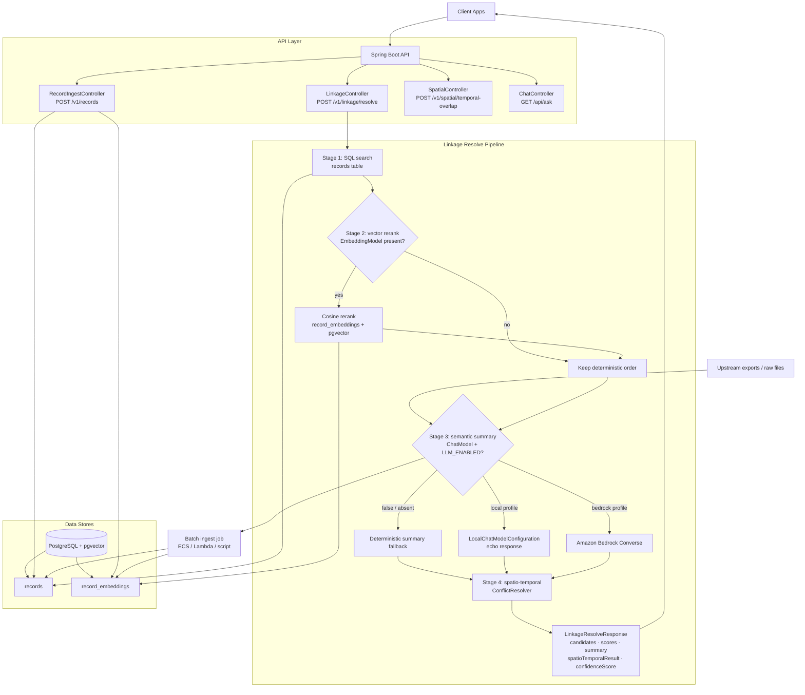
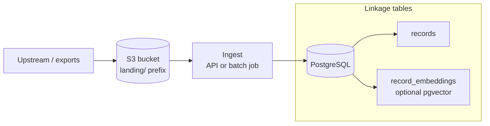

# Architecture: linkage-engine

## 1. Technical Stack

| Layer | Technology |
| :--- | :--- |
| **Language** | Java 21 (Virtual Threads / Project Loom) |
| **Framework** | Spring Boot 3.2 |
| **AI Orchestration** | Spring AI 1.0 |
| **LLM / Embeddings** | Amazon Bedrock Converse (chat) + Titan (embeddings, optional) |
| **Vector store** | Native `pgvector` columns on `record_embeddings` (Flyway-managed); Spring `PgVectorStore` autoconfig is disabled in favour of direct JDBC |
| **Raw landing storage** | Amazon S3 (`landing/` prefix); searchable data lives in PostgreSQL after ingest — see `docs/DATA_PIPELINE_S3.md` |
| **Build** | Maven |

---

## 2. Four-Stage Resolution Pipeline

Every `POST /v1/linkage/resolve` call passes through four ordered stages. Each stage
degrades gracefully when its dependency is absent — the local profile runs all four
stages end-to-end without AWS credentials.

```
POST /v1/linkage/resolve
  └─ Stage 1: SQL search          — deterministic narrowing (name/year/location filters, ±5 year window, LIKE match)
  └─ Stage 2: vector rerank       — cosine similarity reorder (gates on EmbeddingModel bean)
  └─ Stage 3: semantic summary    — LLM narrative (gates on ChatModel + LINKAGE_SEMANTIC_LLM_ENABLED=true)
  └─ Stage 4: spatio-temporal     — historical transit plausibility check (always on; no-op when location/year absent)
```

### Stage 1 — Deterministic SQL search (`LinkageRecordRepository`)
Filters the `records` table on partial name match (`LIKE`), ±5-year window, and
optional location. Returns at most 20 `CandidateRecord` objects ordered by name
relevance. Always runs.

### Stage 2 — Vector rerank (`VectorRerankService`)
Embeds the query via `EmbeddingModel`, fetches stored vectors from `record_embeddings`
for the candidate IDs only (no full-table scan), and reorders by cosine similarity
descending. Skipped silently when `EmbeddingModel` is absent (local profile default).

### Stage 3 — Semantic summary (`SemanticSummaryService`)
Builds a structured prompt from the ranked candidates and calls `ChatModel.call()`.
Returns a `SummaryResult` with a narrative and an `llmUsed` flag.
Falls back to a deterministic summary string when:
- `LINKAGE_SEMANTIC_LLM_ENABLED=false`, or
- `ChatModel` bean is absent, or
- the model call throws.

On the **local profile**, `LocalChatModelConfiguration` provides a `ChatModel` bean
that returns `"[LOCAL] Deterministic summary for: {query}"` — no Bedrock call.

### Stage 4 — Spatio-temporal validation (`ConflictResolver`)
Validates whether movement between the query location/year and the top candidate's
location/year is historically plausible. Uses `HistoricalTransitService` to select
the fastest era-appropriate travel mode and compute minimum travel days via haversine
distance. Runs a `ConflictRule` chain and returns a `SpatioTemporalResponse` with a
full audit trail. Reduces `confidenceScore` by `confidenceAdjustment / 100` when
rules fire. Skipped when either record is missing a location or year.

---

## 3. System Diagram



---

## 4. Ingestion Pipeline (`POST /v1/records`)

```
POST /v1/records (RecordIngestController)
  └─ DataCleansingService          — ordered CleansingProvider chain
       ├─ OCRNoiseReducer          — fixes digit/letter OCR swaps in year-like tokens
       └─ LocationStandardizer     — expands city abbreviations (philly → Philadelphia)
  └─ SQL upsert                    — records table via LinkageRecordMutator
  └─ Embedding (optional)          — TokenTextSplitter → EmbeddingModel → record_embeddings
                                     (gates on SPRING_AI_MODEL_EMBEDDING=bedrock-titan)
```

Raw files from upstream sources are expected to land in **S3** first, then feed
`POST /v1/records` or a batch ingest job. See `docs/DATA_PIPELINE_S3.md`.

---

## 5. Spatio-Temporal Validation (`POST /v1/spatial/temporal-overlap`)

Standalone endpoint backed by the same `ConflictResolver` that Stage 4 uses.
Accepts a `SpatioTemporalRequest` (two anchor records with location + year) and
returns a `SpatioTemporalResponse` with full audit trail.

### Historical transit speed table

| Era | Mode | Speed |
| :--- | :--- | :--- |
| pre-1830 | horse / coach | 50 mi/day |
| 1830–1868 | eastern railroad | 200 mi/day |
| 1869+ | transcontinental rail | 400 mi/day |
| any (cross-continent pre-1869) | ocean ship (Cape Horn) | 150 mi/day, ≥ 18,000 mi |

Distances are straight-line haversine — actual routes are longer, so this is
**generous to plausibility** (under-estimates required travel time).

### ConflictRule chain

| Rule | Trigger | Effect |
| :--- | :--- | :--- |
| `PhysicalImpossibilityRule` | travelDays > availableDays | `plausible=false`, −50 pts |
| `BiologicalPlausibilityRule` | implied age outside [0, 120] via `BORN:YYYY:` recordId prefix | `plausible=false`, −50 pts |
| `NarrowMarginRule` | margin < 5 days (tight but possible) | `plausible=true`, −15 pts |

`confidenceAdjustment` is capped at 50 regardless of how many rules fire.

---

## 6. Design Patterns

### `ObjectProvider` over `@ConditionalOnBean`
Optional dependencies (`EmbeddingModel`, `RecordEmbeddingStore`, `LinkageRecordMutator`)
are injected via `ObjectProvider` and null-checked at runtime. Bean ordering in
Spring autoconfiguration is non-deterministic; `@ConditionalOnBean` on `@Repository`
and `@Service` classes is fragile. `ObjectProvider` is predictable regardless of
context assembly order.

### Chain of Responsibility
Both the cleansing pipeline (`CleansingProvider`) and the conflict rules
(`ConflictRule`) use the same pattern: an interface with a single method, an ordered
list of implementations, and an orchestrator that iterates and aggregates. Adding a
new cleansing step or conflict rule is a one-file change with zero orchestrator
modifications.

Planned extensions that fit this pattern without any structural change:
- `TemporalNormalizationProvider` — normalise "circa 1850", "abt. 1850", "~1850"
  to a canonical year range before SQL search
- `OccupationalPlausibilityRule` — flag implausible occupational mobility
  (e.g. coal miner in two cities 500 miles apart within one week)

### Profile-gated graceful degradation
Each of the four pipeline stages has a defined fallback when its dependency is
absent. The local profile runs the full pipeline end-to-end with no AWS credentials,
making the application demo-safe and integration-testable without cloud access.

---

## 7. Endpoints

| Method | Path | Stage(s) | Status |
| :--- | :--- | :--- | :--- |
| `POST` | `/v1/linkage/resolve` | 1 → 2 → 3 → 4 | Implemented |
| `POST` | `/v1/records` | Ingest pipeline | Implemented |
| `POST` | `/v1/spatial/temporal-overlap` | Stage 4 standalone | Implemented |
| `GET` | `/api/ask` | ChatModel passthrough | Implemented |
| `GET` | `/v1/search/semantic` | Semantic RAG search | Planned |
| `GET` | `/v1/context/neighborhood-snapshot` | Census / news context | Planned |
| `PUT` | `/v1/vectors/reindex` | Delta embedding update | Planned |

---

## 8. Why these choices?

**pgvector over a dedicated vector DB** — keeps relational data and semantic vectors
in a single ACID-compliant store. Hybrid search (SQL narrowing → cosine rerank) runs
in one database with no cross-service latency.

**Spring AI over LangChain4j** — Spring AI's `ChatModel` / `EmbeddingModel`
abstractions are provider-agnostic. Swapping Bedrock for a local Ollama model is a
configuration change, not a code change.

**Java 21 Virtual Threads** — ideal for this workload: multiple high-latency I/O
calls (Bedrock Converse, Titan embeddings, PostgreSQL) without blocking platform
threads or inflating memory with thread pools.

**Haversine as a conservative floor** — actual historical routes are longer than
straight-line distance. Using haversine under-estimates required travel time, making
the plausibility check generous. A false-negative (calling something plausible when
it isn't) is less harmful than a false-positive (rejecting a valid link) in a
genealogical context.

---

## 9. S3 Raw Data Pipeline

Raw exports and bulk source files land in **S3** (`landing/` prefix). Search and
linkage use **PostgreSQL** after ingest — S3 is not queried at query time.



Full conventions (prefixes, IAM, local vs AWS access, env vars): `docs/DATA_PIPELINE_S3.md`.

---

## 10. Deployment

ECS / Fargate scaffolding and Secrets Manager integration: `docs/DEPLOYMENT_ECS_FARGATE.md`.
